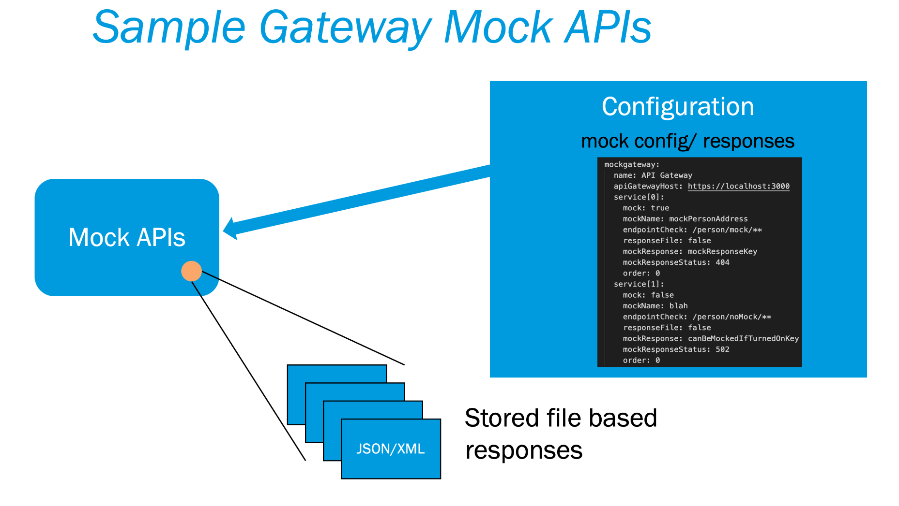

# Mock APIs via Spring Cloud Gateway

Spring Cloud Gateway can be used to Mock APIs while still providing typical gateway proxying functionality. The ability to mock specific APIs can be extremely helpful during frontend or backend SDLC phases, when dependencies aren’t yet available.

This service is built on top of [Spring Cloud Gateway](https://cloud.spring.io/spring-cloud-gateway/reference/html/). To mock endpoints, add property based configuration at [config-props](). Configuration can also be used to add proxy configuration if needed.

  - **Technology stack**: Built on top of Spring Cloud Gateway (which provides proxying capabilities) to provide mock APIs. The current version is based on Java (JDK11).
    This service can be used independently in an ecosystem of services/REST APIs like a proxy/mock APIs.
    The Mock APIs is YAML based easy to use configuration where mock data can be configured as file or config key. The mock response format can be JSON, XML etc. 
  - **Status**:  v1.0.0 is stable. Refer [CHANGELOG](CHANGELOG.md) for new changes.
  - There are Mock APIs like [Mock-Server](https://www.mock-server.com/), [MockApi](https://mockapi.io/), [Beeceptor](https://beeceptor.com/), or [Mocky](https://designer.mocky.io/) etc.
    Most other mocking solutions are only focused on providing mock API responses. This approach provides both gateway and mocking capability, which can be beneficial in many scenarios.
    


---

## Dependencies

Gateway Mock APIs depends on below software:
- Java
- Maven

## Building from Source

Maven tool is required to compile the code. Below is command line:
```shell
mvn install
```

## Installation

#### Command line to build and run
```
# Maven command to build
mvn install

# To run the application
java -jar gateway-mock-service.jar --spring.config.location=optional:classpath:/,optional:classpath:properties/local/,optional:classpath:mock/
OR
mvn spring-boot:run -Dspring-boot.run.jvmArguments='-Dspring.config.location=optional:classpath:/,optional:classpath:properties/local/,optional:classpath:mock/'
```
#### IDE runtime configuration

```
-Dspring.config.location=optional:classpath:/,optional:classpath:properties/local/,optional:classpath:mock/
```

## Configuration

Refer [CONFIGURATION](CONFIGURATION.md) document for configuring Gateway Mock APIs.

## Usage

Refer [Spring Cloud Gateway](https://spring.io/projects/spring-cloud-gateway) for proxying or gateway configuration.
Use Gateway Mock APIs service to call any configured mock endpoint. Refer [CONFIGURATION](CONFIGURATION.md) on how to configure mock APIs.

_Note_: This sample is focused only on mocking APIs. Please consider request sanitization, error handling, etc. before using within your architecture.

## How to test the software

By default, local configuration adds two mock endpoints http://localhost:8089/api/sample/file and http://localhost:8089/api/sample/config.

Use curl to call default mock endpoints:
```shell
# mock response using json file(/main/resources/local/mock/sample.json)
curl localhost:8089/api/sample/file

# mock response using key configuration(local/application.yml -> sampleConfigResponseKey)
curl localhost:8089/api/sample/config
```
JUnit test cases are configured to run the above endpoints. Refer Spring's [Actuator](https://cloud.spring.io/spring-cloud-gateway/multi/multi__actuator_api.html) guide to verify route configuration applied by the gateway and mock configuration.

## Known issues

N/A

## Getting help

Please raise issues for enhancement, problems and feature ideas.

## Getting involved

Using Spring Cloud Gateway with a mocking capability adds a lot of benefit to the SDLC while dependencies aren’t available yet.
Help us make this project even better!

There are still few features which are not supported. like:
- Dynamic response using HTTP header or authentication token as mapper.
- Dynamic configuration of mockServiceHost property.
- Define apiGatewayHost for each mock API configuration.


See: [CONTRIBUTING](CONTRIBUTING.md).

## License
Gateway Mock APIs is Open Source software released under the [Apache 2.0 license](https://www.apache.org/licenses/LICENSE-2.0.html).

----

## Credits and references

1. [Spring Cloud Gateway](https://cloud.spring.io/spring-cloud-gateway/reference/html/).
2. [Sample - Spring Cloud Gateway](https://github.com/spring-cloud-samples/spring-cloud-gateway-sample).

